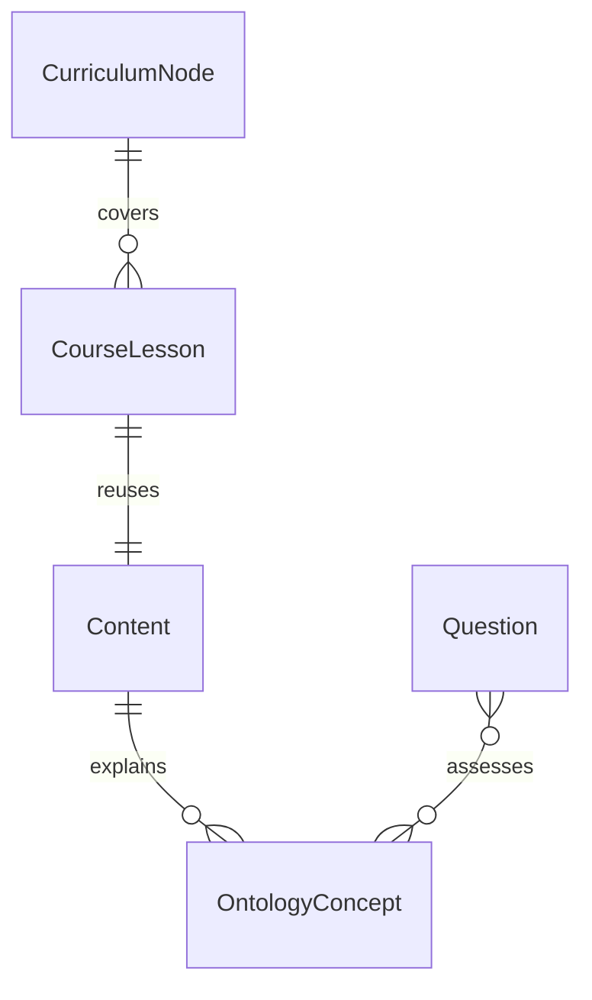

# SECURIUM Ontology Domain Foundation

이 문서는 운영 DB 변경 없이 추가한 온톨로지 도메인 기반을 설명한다.

## 목적

현재 SECURIUM은 `CurriculumTree`, `CurriculumNode`, `Content`, `CourseLesson`,
`Question` 구조를 통해 과정별 학습과 진도를 분리한다. 온톨로지 도메인
서비스는 이 구조를 유지하면서 다음 연결을 일관되게 표현하기 위한
로컬 기반이다.

- 공식 커리큘럼 노드와 공통 Content 연결
- CourseLesson을 통한 과정별 학습 맥락 분리
- Content와 Concept 연결
- 향후 문제, 법령, 기준, 사례, AI Retrieval 확장

## 현재 구현 범위

확인된 사실:

- `lib/services/ontology-service.ts`는 DB에 접근하지 않는 순수 도메인
  서비스다.
- `CourseLesson`과 `Content` 재사용 구조를 변경하지 않는다.
- 운영 migration, seed, 배포는 수행하지 않는다.

제안 및 확장 방향:

- 후속 Sprint에서 `OntologyConcept`, `OntologyEdge` 저장소와 migration을
  추가할 수 있다.
- AI Retrieval은 Concept alias를 우선 검색한 뒤 기존 Content/CourseLesson
  필터를 적용하는 방식으로 확장할 수 있다.
- 과정별 격리는 `courseId`가 있는 edge에서 서버 측으로 검증해야 한다.

## 도메인 모델

## 제공 함수

- `normalizeOntologyLabel`
- `createOntologyConceptKey`
- `createOntologyConcept`
- `dedupeOntologyConcepts`
- `createOntologyEdge`
- `createCurriculumContentOntologyEdges`
- `assertOntologyCourseScope`
- `rankOntologyCoverageGaps`

## 안전 원칙

- 같은 Content를 여러 과정에서 공유하더라도 CourseLesson과 progress는
  과정별로 분리한다.
- 외부 자료 원문을 복제하지 않고 내부 concept key와 근거 ID만 연결한다.
- 공식 출처, PDF 페이지, 기준일은 edge evidence 또는 후속 revision
  필드로 남길 수 있게 한다.
- 운영 DB에 쓰는 단계는 별도 승인 후 진행한다.

## 후속 작업

1. `OntologyConcept`, `OntologyEdge` DB schema 설계
2. D1/PostgreSQL additive migration 작성
3. Repository CRUD 및 관리자 검수 UI 추가
4. Curriculum coverage에서 ontology gap 지표 추가
5. AI RetrievalProvider의 concept-aware 검색 확장
