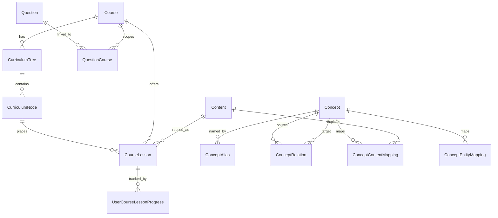

# SECURIUM Ontology and Knowledge Graph Architecture

작성일: 2026-07-31

## 1. 도입 목적

SECURIUM은 여러 정보보호·개인정보보호 과정을 하나의 플랫폼에서 제공하며, 이미 과정, 커리큘럼, 공유 콘텐츠, 문제, AI 검색이 분리된 구조로 확장되어 있다. 온톨로지 도입 목적은 특정 과정에 묶인 자료가 아니라 과정 간에 재사용 가능한 지식 개념을 정의하고, 개념 간 관계를 기반으로 학습 순서, 문제 추천, 오답 복습, AI 설명 근거를 더 정밀하게 만드는 것이다.

이번 문서는 구현 전 분석과 설계안이다. 코드, 마이그레이션, Seed, API, UI는 이 단계에서 변경하지 않았다.

## 2. 현재 구조 분석

### 확인된 사실

- 스키마는 `db/schema.ts`의 Drizzle SQLite DSL(`sqliteTable`)을 기준으로 정의되어 있고, PostgreSQL은 `db/postgres/migrations`와 `db/postgres/schema-manifest.json`으로 별도 마이그레이션을 관리한다.
- `db/postgres/schema-manifest.json` 기준 현재 테이블 수는 70개다.
- 데이터 접근은 API Route에서 직접 SQL을 많이 쓰기보다 `db/*repositories.ts`와 `lib/services/*` 계층을 통해 수행한다.
- D1과 Supabase PostgreSQL은 `db/provider/database-provider.ts`의 `DatabaseProvider` 추상화와 Drizzle 기반 Repository를 함께 사용한다.
- `CourseLesson` 기반 공유 콘텐츠 구조가 이미 있다.
  - `contents`: 재사용 가능한 학습 콘텐츠 본문.
  - `course_lessons`: 특정 과정에서 특정 콘텐츠를 어떤 커리큘럼 노드에 어떤 제목과 난이도/시간/조건으로 제공할지 정의.
  - `course_lesson_extensions`: 과정별 보충 설명, 시험 포인트, 실무 노트 등 오버레이.
  - `user_course_lesson_progress`: 사용자·과정·CourseLesson 단위 진도.
- `curriculum_trees`와 `curriculum_nodes`는 과정별 공식 커리큘럼 계층을 관리한다. `curriculum_nodes.parent_id`는 self-reference FK이며 삭제는 `restrict`다.
- `contents.canonical_key`는 unique constraint가 있고 공유 콘텐츠의 안정 식별자로 쓰인다.
- `content_revisions`는 콘텐츠 기준일, 버전, 최신 버전 단일성, 이전 버전 연결을 관리한다.
- `questions`, `question_courses`, `question_subjects`, `question_topics`는 하나의 문제를 여러 과정·과목·주제에 연결할 수 있게 설계되어 있다.
- 과정별 특화 모델이 이미 존재한다.
  - `isms_standards`, `isms_defect_cases`
  - `legal_articles`, `legal_article_versions`
  - `risk_scenarios`, `risk_calculation_methods`, `risk_grade_criteria`
  - `secure_coding_weaknesses`, `secure_code_samples`
  - `privacy_impact_assessment_items`, `privacy_assessment_scenarios`, `privacy_flow_nodes`, `privacy_flow_edges`
- AI 검색은 `lib/ai/retrieval-provider.ts`의 `RetrievalProvider` 인터페이스와 `db/ai-repositories.ts`의 `DatabaseRetrievalProvider`로 구현되어 있다.
- 현재 검색은 Lessons, LearningUnits, Questions, 법령, ISMS 기준, 결함사례, 위험 시나리오, 보안약점, 영향평가 항목, 검수 콘텐츠 등을 병렬 조회하는 키워드 기반 검색이다.
- `VectorRetrievalProvider` 인터페이스는 존재하지만 pgvector 검색은 아직 활성화되지 않았다.

### 분석상 추정

- 현재 `contents.core_concepts_json`은 자유 JSON으로 핵심 개념을 담을 수 있으나, 개념 간 관계·동의어·선수관계·과정 간 재사용을 정규화하기에는 부족하다.
- 현재 `curriculum_nodes.metadata`의 linked content 정보는 커리큘럼 표시와 연결에는 유용하지만, 지식 그래프 탐색의 주 저장소로 쓰기에는 검색·검증·관계 무결성 관리가 어렵다.
- 기존 D1 호환성을 유지하려면 recursive CTE와 check/index 중심 설계를 사용할 수 있지만, PostgreSQL 전용 고급 기능에 즉시 의존하면 안 된다.

## 3. 온톨로지가 필요한 이유

현재 구조는 “과정별 콘텐츠 제공”에는 충분히 강하다. 하지만 아래 기능을 고도화하려면 콘텐츠와 별개로 “개념”을 1급 엔티티로 관리해야 한다.

- 같은 개념을 여러 과정에서 재사용한다.
- 개념의 동의어, 약어, 한글·영문 표기를 검색에 반영한다.
- 선수 개념을 기반으로 학습 순서를 추천한다.
- 공격, 방어, 취약점, 법령, 기준, 평가항목의 관계를 표현한다.
- 문제 오답을 개념 단위 취약영역으로 환산한다.
- AI Retrieval이 단순 키워드가 아니라 연결된 근거 콘텐츠를 가져오게 한다.

## 4. 기존 엔티티와 신규 엔티티 역할

| 구분 | 현재 역할 | 온톨로지 도입 후 역할 |
| --- | --- | --- |
| `Course` | 과정 단위 | 개념 노출 범위와 학습 맥락 |
| `CurriculumTree` | 과정별 커리큘럼 버전 | 과정별 공식 학습 구조 |
| `CurriculumNode` | 커리큘럼 계층 노드 | 개념이 배치되는 공식 위치 |
| `Content` | 공유 학습 본문 | 개념을 설명하는 자료 |
| `CourseLesson` | 과정별 콘텐츠 제공 맥락 | Content를 특정 Course/CurriculumNode에 제공하는 브리지 |
| `Question` | 평가 문항 | 개념 이해도를 측정하는 평가 항목 |
| `ContentRevision` | 콘텐츠 버전 | 개념 연결이 참조하는 검수된 최신 콘텐츠 기준 |
| `Concept` | 없음 | 과정과 독립적인 지식 개념 |
| `ConceptAlias` | 없음 | 검색·표기용 동의어/약어/별칭 |
| `ConceptRelation` | 없음 | 개념 간 방향성 있는 관계 |
| `ConceptContentMapping` | 없음 | Concept ↔ Content 정규화 매핑 |
| `ConceptEntityMapping` | 없음 | Concept ↔ 기존 엔티티 범용 매핑 |

핵심 원칙은 `Content`와 `Concept` 분리다. `Content`는 읽을 수 있는 자료이고, `Concept`는 자료와 문제와 커리큘럼을 관통하는 지식 단위다.

## 5. 엔티티 관계도



## 6. 관계 유형 정책

### 전체 후보

- `BROADER_THAN`
- `NARROWER_THAN`
- `PART_OF`
- `HAS_PART`
- `PREREQUISITE_OF`
- `REQUIRES`
- `RELATED_TO`
- `SAME_AS`
- `ATTACKS`
- `EXPLOITS`
- `MITIGATED_BY`
- `DETECTED_BY`
- `PREVENTED_BY`
- `USES`
- `IMPLEMENTS`
- `APPLIES_TO`
- `MAPPED_TO`
- `ASSESSED_BY`

### 초기 권장 관계

초기 구현에서는 아래 7개만 허용하는 것이 안전하다.

- `BROADER_THAN`: 상위 개념 관계
- `PART_OF`: 구성 요소 관계
- `PREREQUISITE_OF`: 선수 학습 관계
- `RELATED_TO`: 약한 관련 관계
- `MITIGATED_BY`: 취약점·위험의 완화 관계
- `DETECTED_BY`: 탐지 기준·증적·로그 관계
- `USES`: 기술·절차 사용 관계

### 관계 방향 정책

- 방향성은 명시적으로 저장한다.
- 역관계 자동 생성은 초기에는 하지 않는다. 예: `BROADER_THAN`과 `NARROWER_THAN`을 동시에 자동 생성하지 않는다.
- UI/API에서 필요하면 역방향 조회를 지원하되 원본 relation row는 하나로 유지한다.
- 자기 참조는 금지한다.
- 같은 `(sourceConceptId, relationType, targetConceptId)` 조합은 중복 금지한다.
- `weight`는 추천 강도, `confidence`는 관계 검수 신뢰도로 사용한다.
- 초기 상태는 `DRAFT`, 일반 검색과 AI 검색은 `APPROVED` 또는 `PUBLISHED`만 사용한다.

## 7. canonical key 정책

### 확인된 사실

`contents.canonical_key`는 이미 unique constraint가 있으며 공유 콘텐츠의 안정 식별자다.

### 권장 정책

`contents.canonical_key`를 Concept 생명주기 키로 직접 재사용하지 않는다. Concept에는 별도 `canonicalKey`를 둔다.

권장 형식:

- 보안 개념: `security.network.arp-spoofing`
- ISMS-P 기준 개념: `isms-p.control.2.6.access-control`
- 개인정보 법령 개념: `privacy-law.pipa.article-29`
- CWE 개념: `cwe.cwe-89.sql-injection`
- 위험관리 개념: `risk.asset-threat-vulnerability`

규칙:

- 소문자 kebab-case 또는 dot namespace 사용.
- 과정명은 가능한 한 넣지 않는다. 과정 독립 개념으로 유지한다.
- 공식 외부 식별자가 있으면 namespace에 반영한다. 예: CWE, 법령 조문, ISMS-P 기준번호.
- 동일 개념의 표기 차이는 `ConceptAlias`로 해결한다.
- Content와 Concept의 canonical key가 같아야 한다는 규칙은 두지 않는다.

## 8. 데이터 생성 및 검색 정책

초기 데이터 생성은 자동 추출보다 관리자 검수형 수동 Seed가 안전하다.

권장 순서:

1. 30~50개 핵심 Concept 수동 작성.
2. 기존 `contents.core_concepts_json`과 `questions` 제목/해설에서 후보 alias 추출.
3. 관리자가 후보를 승인해 `ConceptAlias`와 `ConceptEntityMapping` 생성.
4. AI Retrieval은 승인된 Concept와 published 콘텐츠만 사용.

검색 통합:

- 기존 `DatabaseRetrievalProvider`는 계속 유지한다.
- `ConceptAlias`를 키워드 확장 계층으로 추가한다.
- 검색어가 alias에 매칭되면 관련 Concept의 Content/Question/CurriculumNode 매핑을 조회한다.
- 결과에는 `sourceContextIds`와 함께 Concept ID를 별도 metadata로 포함한다.
- `limit`은 현재 `clampRetrievalLimit` 정책처럼 상한을 둔다.

## 9. AI 사용 방식

AIProvider 구조는 재작성하지 않는다.

권장 연결 방식:

- `RetrievalProvider.search*` 내부 또는 별도 `OntologyRetrievalRepository`에서 Concept alias를 먼저 조회한다.
- Concept 매핑을 통해 관련 Content/Question/Standard/Law를 가져온다.
- AI 프롬프트에는 검수된 근거 ID, 제목, 짧은 발췌만 전달한다.
- 답변에는 “AI 생성 참고 설명” 고지를 유지한다.
- ConceptRelation은 추천 이유 생성에 사용한다.
  - 예: “SQL 삽입은 입력값 검증과 파라미터 바인딩 개념과 연결되어 있습니다.”

## 10. RAG 사용 방식

초기 RAG는 벡터 검색 없이 다음 순서로 충분하다.

1. 검색어 정규화.
2. `ConceptAlias.normalizedAlias` exact/prefix/LIKE 조회.
3. 연결 Concept 조회.
4. Concept와 매핑된 Content, Question, LegalArticle, IsmsStandard 등 조회.
5. `ContentRevision`의 최신 published 버전을 우선 사용.
6. 관계 그래프 1-hop 또는 2-hop 확장.
7. 과정 필터가 있으면 Course, CourseLesson, QuestionCourse, ContentCourseLink 기준으로 제한.

향후 pgvector가 활성화되면 Concept/Content embedding을 별도 테이블에 추가하되, Concept canonical key는 유지한다.

## 11. PostgreSQL 조회 방식

PostgreSQL에서는 recursive CTE로 ConceptRelation을 탐색할 수 있다.

예시 개념:

```sql
WITH RECURSIVE concept_graph AS (
  SELECT
    source_concept_id,
    relation_type,
    target_concept_id,
    1 AS depth
  FROM concept_relations
  WHERE source_concept_id = $1
    AND status = 'PUBLISHED'

  UNION ALL

  SELECT
    r.source_concept_id,
    r.relation_type,
    r.target_concept_id,
    g.depth + 1
  FROM concept_relations r
  JOIN concept_graph g
    ON r.source_concept_id = g.target_concept_id
  WHERE r.status = 'PUBLISHED'
    AND g.depth < 2
)
SELECT * FROM concept_graph;
```

주의:

- 사용자 요청에서 depth 상한을 반드시 둔다.
- 순환 방지를 위해 visited path 또는 depth 제한을 둔다.
- API Route에 직접 SQL을 쓰지 말고 Repository에 둔다.
- D1과 PostgreSQL의 SQL 방언 차이를 고려해 Provider별 SQL 생성 유틸 또는 안전한 Drizzle 쿼리 우선으로 구현한다.

## 12. D1 호환성

SQLite/D1도 recursive CTE를 지원하지만, 운영 특성과 SQL 방언 차이가 있다.

호환성 정책:

- 기본 CRUD와 1-hop 조회는 Drizzle 쿼리로 구현한다.
- 2-hop 이상 그래프 탐색은 초기에는 애플리케이션 계층에서 반복 조회하거나 provider별 SQL로 분리한다.
- PostgreSQL 전용 타입(enum, jsonb, vector)에 의존하지 않는다.
- JSON은 현재 프로젝트처럼 `text` + JSON 문자열 검증을 기본으로 한다.
- FK on delete는 중요한 콘텐츠/학습 기록 보호를 위해 `restrict`를 우선한다.

## 13. Migration 계획

STEP 2의 최소 migration 범위:

1. `concepts`
2. `concept_aliases`
3. `concept_relations`
4. `concept_content_mappings`
5. `concept_entity_mappings`

권장 주요 제약:

- `concepts.canonical_key` unique
- `concepts.slug` unique
- `concept_aliases(concept_id, normalized_alias, language)` unique
- `concept_relations(source_concept_id, relation_type, target_concept_id)` unique
- `concept_relations.source_concept_id <> target_concept_id` check
- `concept_content_mappings(concept_id, content_id, mapping_type)` unique
- `concept_entity_mappings(concept_id, entity_type, entity_id, mapping_role)` unique
- relation/status/type 필드는 check constraint로 제한
- 모든 FK delete는 기본 `restrict`

기존 테이블 삭제나 destructive migration은 필요하지 않다.

## 14. Seed 계획

초기 Seed는 샘플/개발용임을 명확히 표시한다.

권장 최소 Seed:

- 보안 일반 핵심 Concept 20개
- 개인정보/법령 Concept 10개
- ISMS-P 기준 Concept 10개
- 보안약점/CWE Concept 10개
- 위험관리 Concept 10개
- Alias 2~3개씩
- Relation은 초기 50~100개 이하
- Content/Question/CurriculumNode 매핑은 검증 가능한 일부만 시작

Seed 실패가 운영 데이터에 영향을 주지 않도록 idempotent upsert 또는 insert-ignore 패턴을 사용한다.

## 15. 관리자 기능 계획

초기 관리자 기능:

- Concept 목록/검색
- Concept 생성/수정/보관
- Alias 관리
- Relation 관리
- Content/Question/CurriculumNode 매핑 관리
- 검수 상태 변경
- Concept 사용처 조회

권한:

- 조회: 관리자 또는 콘텐츠 편집자 이상
- 생성/수정: `CONTENT_EDITOR`, `CONTENT_REVIEWER`, `COURSE_MANAGER`, `ADMIN`
- 승인/게시: `CONTENT_REVIEWER`, `ADMIN`
- 삭제 대신 `ARCHIVED` 상태 우선

감사로그 대상:

- Concept 생성/수정/보관
- Relation 생성/수정/보관
- Concept mapping 생성/삭제
- Concept 게시/반려

## 16. 검증 계획

자동화 테스트:

- Concept canonical key unique
- Alias normalized 중복 방지
- 자기 참조 relation 차단
- 중복 relation 차단
- DRAFT relation이 일반 검색에 노출되지 않음
- Course 필터가 다른 과정 콘텐츠를 섞지 않음
- Question ↔ Concept 매핑 조회
- CurriculumNode ↔ Concept 매핑 조회
- AI Retrieval에서 Concept 근거 ID가 포함됨
- 일반 사용자 관리자 API 접근 차단

수동 검증:

- 관리자 화면에서 Concept 생성 후 검색 노출 확인
- 기존 과정/문제/레슨 화면이 영향 없이 동작하는지 확인
- AI 튜터에서 Concept alias 검색 결과가 기존 검색보다 나아지는지 확인

## 17. 단계별 구현 순서

1. Drizzle schema에 Concept 계열 테이블 추가.
2. D1 migration 추가.
3. PostgreSQL migration 추가.
4. schema manifest 갱신.
5. `db/ontology-repositories.ts` 추가.
6. `lib/services/ontology-service.ts` 추가.
7. 검증 스키마를 `lib/validation.ts`에 추가.
8. Repository 단위 테스트 작성.
9. `DatabaseRetrievalProvider`에 ConceptAlias 기반 검색 확장.
10. AI Retrieval 테스트 보강.
11. 관리자 API 추가.
12. 관리자 UI 추가.
13. Seed 추가.
14. 운영 migration 승인 후 적용.

## 18. 위험과 대응 방안

| 위험 | 영향 | 대응 |
| --- | --- | --- |
| Concept와 Content 역할 혼합 | 중복 모델과 검색 혼란 | Concept는 지식 단위, Content는 설명 자료로 분리 |
| 관계 타입 과다 | 관리자 UI와 검수 복잡도 증가 | 초기 7개 관계만 활성화 |
| D1/PostgreSQL SQL 차이 | 배포 환경별 오류 | 1-hop은 Drizzle, recursive는 provider별 Repository |
| 순환 relation | 추천/검색 무한 탐색 | 자기참조 check, depth 제한, visited set |
| 비검수 개념 노출 | AI 답변 품질·신뢰 하락 | published/approved만 Retrieval 포함 |
| N+1 조회 | 대시보드/AI 응답 지연 | 매핑 대상 ID를 모아 batch 조회 |
| 기존 검색 품질 저하 | AI 답변 퇴보 | 기존 검색을 유지하고 Concept 검색을 보강 계층으로 추가 |
| 운영 migration 리스크 | 배포 장애 | 새 테이블만 추가, 기존 테이블 변경 없음 |

## 19. Neo4j 도입 판단 기준

초기에는 Neo4j를 도입하지 않는 것이 적합하다.

도입 검토 기준:

- Concept 수가 수만 개 이상으로 증가.
- 3-hop 이상 그래프 탐색이 핵심 기능이 됨.
- 관계 기반 추천이 SQL/애플리케이션 계층에서 성능 한계에 도달.
- 운영팀이 별도 graph DB 백업/모니터링/권한 체계를 관리할 준비가 됨.
- RAG 검색에서 graph traversal이 핵심 랭킹 신호가 됨.

그 전까지는 PostgreSQL/Drizzle + stable canonical key + provider별 graph query로 충분하다.

## 20. 롤백 전략

초기 구현은 기존 테이블을 변경하지 않고 새 테이블만 추가한다.

롤백:

1. 온톨로지 기반 검색 플래그 비활성화.
2. AI Retrieval에서 Concept 확장 경로 제거.
3. 관리자 온톨로지 메뉴 숨김.
4. 신규 Concept 테이블은 보존하되 서비스에서 사용하지 않음.
5. 필요 시 신규 테이블 drop은 별도 백업 후 승인 기반으로만 수행.

## 최종 분석 결과

### 현재 온톨로지 도입 가능 여부

가능하다. 현재 공유 콘텐츠, CourseLesson, CurriculumNode, ContentRevision, AI Retrieval 구조가 이미 분리되어 있어 온톨로지를 새 계층으로 추가하기 좋다.

### 그대로 사용할 기존 구조

- `contents`
- `course_lessons`
- `course_lesson_extensions`
- `user_course_lesson_progress`
- `curriculum_trees`
- `curriculum_nodes`
- `questions`
- `question_courses`
- `content_revisions`
- `content_course_links`
- `content_question_links`
- `DatabaseRetrievalProvider`
- 기존 RBAC/감사로그 패턴

### 추가할 엔티티

- `Concept`
- `ConceptAlias`
- `ConceptRelation`
- `ConceptContentMapping`
- `ConceptEntityMapping`

### 최소 Migration 범위

신규 5개 테이블과 관련 index/check/unique/FK 추가만 필요하다. 기존 테이블 변경이나 데이터 이관은 초기 단계에서 필요하지 않다.

### 기존 기능 호환성 위험

낮음. 단, RetrievalProvider에 Concept 검색을 붙일 때 기존 키워드 검색 결과 순서가 바뀔 수 있으므로 feature flag 또는 보강 검색 방식으로 점진 적용하는 것이 좋다.

### D1/PostgreSQL 호환성

가능하다. 초기 CRUD와 1-hop 조회는 공통 Drizzle 쿼리로 구현하고, recursive CTE는 PostgreSQL/D1 호환 SQL 차이를 Repository 내부에서 분리해야 한다.

### 권장 관계 유형

초기에는 `BROADER_THAN`, `PART_OF`, `PREREQUISITE_OF`, `RELATED_TO`, `MITIGATED_BY`, `DETECTED_BY`, `USES`만 활성화한다.

### 권장 구현 단계

1. Schema/Migration 추가
2. Repository/Service 추가
3. Domain 테스트
4. RetrievalProvider 보강
5. Admin API
6. Admin UI
7. Seed
8. 운영 migration

### STEP 2에서 변경할 파일 후보

- `db/schema.ts`
- `drizzle/*_ontology*.sql`
- `db/postgres/migrations/*_ontology*.sql`
- `db/postgres/schema-manifest.json`
- `db/ontology-repositories.ts`
- `lib/services/ontology-service.ts`
- `lib/validation.ts`
- `db/ai-repositories.ts`
- `lib/ai/retrieval-provider.ts`
- `app/api/admin/ontology/*`
- `app/admin/ontology/*`
- `tests/ontology-domain.test.ts`
- `tests/ai-domain.test.ts`

