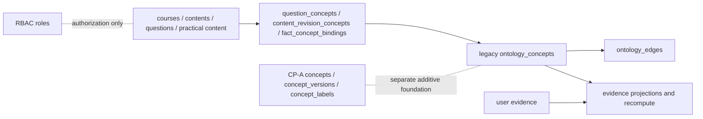
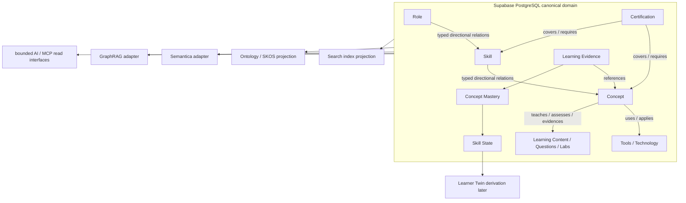

# Securium Role / Skill / Concept Graph Foundation Audit

- Snapshot date: 2026-09-07
- Worktree: `securium-skill-graph-foundation`
- Branch: `architecture/role-skill-concept-graph-foundation`
- HEAD: `9756970ce19a64d6ac0e913631193b606dc78e7c`
- Fresh `origin/main`: `67686548da982cd9f3c11806ac21b95cf4be526a`
- Current ahead/behind: `0/1` (branch is one commit behind fresh `origin/main`)
- Initial worktree: clean
- Scope: read-only repository audit plus these two report artifacts

## Executive decision

**Final Status:** `BLOCK_SECURIUM_ROLE_SKILL_CONCEPT_GRAPH_DUPLICATE_SOURCE_OF_TRUTH`

**Decision:** `REPAIR_SECURIUM_GRAPH_CANONICAL_AUTHORITY`

The repository has a real runtime ontology/concept graph, but it also contains a separate CP-A concept persistence foundation. The legacy `ontology_concepts` authority is used by runtime content, question, fact, and evidence mappings; CP-A `concepts`/`concept_versions`/`concept_labels` is additive and intentionally not backfilled or materialized into the legacy graph. This is a material duplicate Concept authority until one canonical path is selected and the other is explicitly made a projection or retired.

There is no occupational Role entity, no Skill entity, no first-class Tool/Technology entity, and no Certification entity. The current model is therefore **FOUNDATION_ONLY** for the requested Role → Skill → Concept → Tools/Technology → Content → Certification → Evidence graph.

## Current state

### Worktree and safety boundary

- No application/schema/migration/production code was changed.
- No migration was added or edited.
- No production database was accessed or modified.
- No deployment, commit, push, or PR was performed.
- Only this Markdown report and the machine report were created.

### Canonical entity inventory

| Requested entity | Current implementation | Stable identity | Current authority | Runtime use | Classification |
|---|---|---|---|---|---|
| Role | `roles` RBAC table in `db/schema.ts`; seed roles are USER, COURSE_MANAGER, CONTENT_EDITOR, CONTENT_REVIEWER, ADMIN, SUPER_ADMIN | numeric `id`, unique `code` | RBAC only | authorization | Not an occupational/product Role |
| Skill | no first-class table/model found | none | none | none | Absent |
| Concept | legacy `ontology_concepts`; separate CP-A `concepts`, `concept_versions`, `concept_labels` | legacy `key`/namespace-normalized identity; CP-A concept id | Conflicting material authorities | legacy ontology and mappings use legacy table; CP-A is isolated | Duplicate authority blocker |
| Tool/Technology | no first-class entity | none | none | content metadata/tags only where present | Absent as canonical graph entity |
| Certification | no first-class entity | none | none | certification-like products appear as course/course-group data and labels | Mixed/course-local |
| Course | `courses`, course groups and content-course links | course id, slug/code fields | course catalog | production content/catalog | Canonical course domain, not certification authority |
| Lesson/content | `contents`, `content_revisions`, course/content links | content/revision ids and canonical content key | content domain | learner/admin content | Present |
| Question | question tables plus `question_concepts` | question id and mapping id | question/content domain | assessment | Present; concept mapping uses legacy concepts |
| Lab/exercise | practical content/version and binding structures where present | content/practical version ids | content/evidence domain | partial practical learning | Partial |
| Evidence | evidence projections and recompute structures | user/evidence/projection ids | personal evidence projection | mastery/projection pipeline | Concept-targeted, no Skill target |

Relevant evidence locations include `db/schema.ts` RBAC `roles` near lines 35-41; CP-A concepts near 324-380; legacy ontology near 3280-3384; course/content tables near 407-454 and 774-818; content/question concept mappings near 1164-1222 and 4206-4265; and evidence projections near 4337-4466.

### Relation inventory

The repository has one generic legacy `ontology_edges` table and several specialized mapping/bridge families. The generic graph has typed enum-like relation values, explicit direction, confidence/evidence/status fields, and polymorphic endpoints. It does not have database-enforced endpoint type signatures or a complete canonical registry for Role/Skill/Tool/Certification.

Specialized mappings include:

- `content_revision_concepts` → `ontology_concepts`, with mapping status/version, qualification, provenance, source, review and lifecycle fields.
- `question_concepts` → `ontology_concepts`, with analogous mapping metadata.
- `fact_concept_bindings` → `ontology_concepts`, with mapping governance metadata.
- evidence projection/recompute records → `ontology_concepts`, with mapping hashes, projection versions and invalidation/recompute state.
- `content_course_links.relation_type` and `content_question_links.relation_type`, which are free-form text fields and can drift from the ontology relation vocabulary.

Current relation types in the ontology service include `COVERS`, `EXPLAINS`, `TESTS`, `REUSES_CONTENT`, `ASSESSED_BY`, `PREREQUISITE_OF`, `RELATED_TO`, `DERIVED_FROM`, `PARENT_OF`, `CHILD_OF`, `SYNONYM_OF`, and `CROSS_COURSE_EQUIVALENT`. This is typed only within the legacy ontology vocabulary; the requested Role/Skill/Concept relation vocabulary is not implemented.

Direction is explicit in the generic graph. Some inverse pairs are stored twice, such as `PARENT_OF`/`CHILD_OF` and cross-course equivalents. There is no single repository-wide inverse policy, and duplicate semantic edges can coexist across generic edges, specialized mapping tables, JSON metadata, and course-local relation strings.

### Exact audit answers

- **A/B:** No occupational Role or Skill entities. Only six RBAC seed roles; no Skill table/model.
- **C:** Concepts exist in two material families: runtime legacy ontology concepts and isolated CP-A concepts. They are not proven to be globally shared through one authority.
- **D:** No canonical Tool/Technology entity; technologies are metadata/content-level or planned.
- **E:** No Certification entity. Certification-like offerings are represented through courses/course groups and labels.
- **F:** Legacy concepts connect to content, questions, facts, and evidence. Role, Skill, Tool, and Certification joins are absent.
- **G:** Relations are partly typed and directional in `ontology_edges`; specialized mappings are typed by table but not a complete graph contract; version/provenance/lifecycle are partial.
- **H:** A partial legacy ontology graph exists, not a complete Skill Graph.
- **I:** A partial concept graph exists, but duplicate authority prevents calling it canonical.
- **J:** No implemented SKOS model. Ontology infrastructure is a partial domain graph, not a governed SKOS projection.
- **K:** The CP-A concepts family is a second material concept authority/foundation; no external graph/search authority was found.
- **L:** Evidence can map to legacy Concepts through evidence projections; no stable Skill mapping exists.
- **M:** Runtime ontology, mapping, evidence projection and admin review code are real. Neo4j, Semantica, Elasticsearch, GraphRAG, Learner Twin, and AI/MCP graph changes are absent.

### Course, certification, and qualification boundary

The current architecture is certification/course-first. Products such as ISMS-P, ISE, ISIE, ISRM, SW vulnerability diagnosis, CPPG, and PIA appear as course/catalog representations. No separate certification authority, exam body, qualification version, or certification-to-concept/skill coverage model was found. Adding a certification today would attach to course structures or labels, not to a stable Role/Skill/Concept graph. This is a high data-model risk, not evidence that courses are themselves certifications.

### Canonicalization, aliases, SKOS, and ontology

- Canonicalization exists in the legacy ontology key/namespace path and retrieval/alias logic.
- CP-A provides concept version/label structures but is explicitly additive and separate from legacy ontology writes.
- Aliases/synonyms exist in legacy alias structures and CP-A labels, but there is no unified preferred-label/alt-label authority.
- SKOS status: **ABSENT** as an implemented model (`prefLabel`, `altLabel`, `broader`, `narrower`, `related`, scheme governance not implemented as SKOS).
- Ontology status: **PARTIAL_FOUNDATION**. It is runtime code and storage, but not the canonical full product graph and not a read-only projection from a settled Role/Skill/Concept authority.
- Ontology mutation does not appear to be an external second graph database authority. The material internal conflict is between legacy ontology concepts and CP-A concepts.

### Evidence and personal graph boundary

The evidence projection path is user-private and concept-targeted. It includes mapping hashes, projection versions, lifecycle, recompute requests, and invalidation-oriented structures. It does not provide `Evidence → Skill` or a canonical `user_skill_state` derivation target. The personal competency graph must remain a consumer of shared Knowledge Graph identities; it must not create per-user Skills or Concepts. Current separation is conceptually present but incomplete because the shared graph itself lacks stable Role/Skill identity closure.

## Current-state architecture

This diagram is factual and intentionally does not show Role, Skill, Tool, or Certification edges that do not exist.

## Target architecture (not implemented)

All projection layers remain downstream of PostgreSQL. No target component authorizes canonical domain mutations independently.

## Capability assessment

| Capability | Current support |
|---|---|
| Role → Skills | UNSUPPORTED |
| Skill → Concepts | UNSUPPORTED |
| Concept → Roles | UNSUPPORTED |
| Concept → Skills | UNSUPPORTED |
| Concept → Tools | UNSUPPORTED |
| Concept → Content | PARTIAL through legacy concept mappings |
| Concept → Certifications | UNSUPPORTED |
| Concept → Evidence | PARTIAL through evidence projections |
| Certification → Concepts | UNSUPPORTED |
| Certification → Skills | UNSUPPORTED |
| Role → Certification | UNSUPPORTED |
| Must-Know Concepts cards | PARTIAL; concept content can be read, but Role/Skill/Certification context is missing |
| Visual Knowledge Map | FOUNDATION_ONLY |

### Concept hub test

The shared-concept hub test is **PARTIAL** for legacy content/question/evidence links and **NO** for the complete requested closure. SQL Injection, XSS, Authentication, Authorization/IDOR, Input Validation, Race Condition, and Cryptography may appear as content-local or ontology labels, but no stable Role → Skill → Concept → Tool → Content → Certification → Evidence chain is discoverable from canonical data. Live link counts were not queried because no database access was authorized.

Candidate duplicate/near-duplicate labels requiring review, not automatic merging, include:

- Command Injection / OS Command Injection / Shell Injection / Code Injection
- Authentication / MFA / JWT
- Authorization / Access Control / IDOR / BOLA
- Cryptography / Encryption / Cryptographic Algorithm
- XSS and reflected/stored/DOM XSS variants

### Granularity findings

- Concepts mix principles, vulnerabilities, protocols, controls, standards, and assessment topics; boundaries are not governed.
- Skills are absent as a taxonomy, so task, capability, topic, and certification-preparation labels cannot yet be separated.
- RBAC Roles mix authorization personas, not occupations; no evidence of a product Role taxonomy.
- Tool/Technology is not modeled, so language, framework, protocol, platform, security tool, and standard cannot be typed separately.

## Invariants G1-G12

| Invariant | Result | Finding |
|---|---|---|
| G1 PostgreSQL canonical graph authority | PARTIAL | PostgreSQL is the intended canonical runtime, but Concept authority is split internally. |
| G2 stable Role/Skill/Concept identities | PARTIAL | Concept identities exist in two families; Role/Skill identities are absent. |
| G3 typed directional relations | PARTIAL | Legacy graph is typed/directional; requested relation contract is incomplete and some links are free-form. |
| G4 content mappings use canonical Concept identities | PARTIAL | Runtime mappings use legacy concepts, while CP-A is separate. |
| G5 certification is not top-level authority | NOT_IMPLEMENTED | Current IA/data model is course/certification oriented without a distinct certification model. |
| G6 Concept cross-course/certification hub | PARTIAL | Legacy concept links cross content, but no complete cross-certification graph exists. |
| G7 mappings are versionable | PARTIAL | Specialized mappings have versions; generic relation governance is incomplete. |
| G8 mapping changes invalidate projections | PARTIAL | Evidence recompute/invalidation exists for concept projections; no Skill/Recommendation/credential closure. |
| G9 search/ontology/graph DB are projections | CONFLICT | CP-A is a competing material Concept foundation until authority is repaired. |
| G10 personal graph references shared graph | PARTIAL | Evidence references legacy concepts; Skills are unavailable and personal Skill creation is not yet governed. |
| G11 Learner Twin derives from evidence/state | NOT_IMPLEMENTED | No Learner Twin or canonical Skill State derivation exists. |
| G12 Must-Know UX from graph without ontology exposure | PARTIAL | Existing concept/content read paths help, but graph closure is missing. |

## Risk and governance findings

### P0

1. **Duplicate Concept authority:** legacy `ontology_concepts` is the runtime authority while CP-A `concepts`/versions/labels is a separate foundation. This can produce divergent identities, labels, aliases, and mappings.
2. **Cross-layer relation duplication:** generic ontology edges, specialized mapping tables, JSON/content metadata, and free-form relation text can disagree without a declared authority.

No client-controlled canonical Role/Skill/Concept mutation or external graph database authority was found in the inspected repository. If later routes expose graph writes, they must be reviewed before activation.

### P1

- Establish occupational Role inventory and stable identity.
- Establish Skill inventory and prevent topic/tool/task/certification taxonomy leakage.
- Close canonical Concept identity, aliases, provenance, and lifecycle.
- Define typed, directional, endpoint-constrained relations.
- Add Role → Skill, Skill → Concept, Concept → Tool/Technology, and Concept → Content mappings.
- Add Certification as a separate authority with Concept/Skill coverage.
- Add mapping version, provenance, review, confidence, and invalidation semantics.
- Keep Evidence → Concept/Skill references downstream of canonical entities.

### P2

- SKOS enrichment and ontology projection.
- Search/index projection.
- Semantica adapter, graph database projection, GraphRAG, GrowMap-like visualization.
- Advanced recommendation, AI agent, and MCP graph navigation.

### Security, trust, and privacy

- Security Critical: none found in static inspection.
- Security High: generic polymorphic graph endpoints lack strong database endpoint signatures; free-form relation fields increase semantic abuse risk if exposed for writes.
- Data Trust Critical: duplicate Concept authority.
- Data Trust High: parallel relation representations and course/certification conflation.
- Privacy Critical: none found.
- Privacy High: preserve strict separation between non-PII Knowledge Graph data and user-private Evidence/Competency state.

### Provenance, lifecycle, currentness, governance

Legacy specialized mappings have meaningful provenance, source, review/status, version, and timestamp fields. Coverage is not uniform across generic edges, course-local relations, or CP-A. `DRAFT`/`REVIEWED`/`ACTIVE`/`DEPRECATED`-like behavior is partial. Currentness/review-date semantics are appropriate for certification and source-derived mappings, but should not be imposed globally without domain evidence. There is no complete review/governance process for Role/Skill/Concept/Relation changes.

### Rights and source boundary

Certification/content-derived mappings should preserve independent authoring decisions, source attribution, review, and rights boundaries. Restricted source taxonomies must not be copied into a canonical graph without authorization.

## PostgreSQL, D1, migrations, tests, UI, and APIs

### Database strategy and parity

- Supabase PostgreSQL remains the intended primary canonical runtime authority.
- Cloudflare D1 remains the local/compatibility/rollback path.
- Both Drizzle/D1 and PostgreSQL migration families contain the legacy ontology, content-concept, evidence, and CP-A foundations.
- PostgreSQL has stronger privilege/RLS treatment in the inspected ontology migration path.
- Neither side has an occupational Role, Skill, Tool/Technology, or Certification graph authority.
- No live database was queried; counts are repository/seed counts only.

### Migration inventory

Relevant D1/Drizzle migrations: `0019_ontology_graph_storage.sql`, `0020_security_certification_taxonomy_cleanup.sql`, `0021_security_certification_taxonomy_validation_fixes.sql`, `0023_canonical_fact_foundation.sql`, `0027_evidence_projection_foundation.sql`, `0028_theory_revision_governance.sql`, `0029_evidence_e1_core_remediation.sql`, `0031_evidence_e2_a_recompute_operations.sql`, `0032_concept_persistence_cp_a.sql`.

Relevant PostgreSQL migrations: `0008_ontology_graph_storage.sql`, `0009_security_certification_taxonomy_cleanup.sql`, `0011_canonical_fact_foundation.sql`, `0012_fact_concept_mapping_governance.sql`, `0013_question_governance_foundation.sql`, `0015_evidence_projection_foundation.sql`, `0016_theory_revision_governance.sql`, `0017_evidence_e1_core_remediation.sql`, `0019_evidence_e2_a_recompute_operations.sql`, `0020_concept_persistence_cp_a.sql`.

### Tests and validation

- Ontology/canonicalization focused command: 7 tests; 2 passed, 5 were blocked by missing packages (`zod`, `miniflare`).
- No separately named relation-test target was found; relation coverage is embedded in the ontology/security-certification ontology tests and was dependency-blocked.
- Migration namespace guard: 2 related tests passed.
- PostgreSQL migration guard: 8/10 passed; one repository deploy-runner assertion failed (`false !== true`); disposable PostgreSQL fixture failed because package `postgres` is missing.
- Typecheck: blocked because `tsc` is not installed/resolvable.
- Lint: blocked because `eslint` is not installed/resolvable.
- `db:check`: blocked because `drizzle-kit` is not installed/resolvable.
- `git diff --check`: PASS.
- These dependency failures were not repaired because installing dependencies would change the worktree/environment beyond this read-only audit gate.

### UI and API inventory

- UI/admin exposure includes `/admin/ontology` and related review/preflight surfaces; no learner-facing Must-Know Concepts graph UX was found.
- APIs include `/api/admin/ontology/review-status` and `/api/admin/ontology/canonicalization-preflight`; these expose legacy ontology administration, not a complete canonical Role/Skill graph.
- No public read API was found that guarantees Role → Skill → Concept → Certification closure.
- Hard-coded ontology entity/relation arrays and content `coreConcepts` metadata exist in code/data paths; these are not a canonical Role/Skill graph.
- Documentation, wireframes, benchmarks, and demo/report artifacts are placeholders or plans, not canonical runtime edges.

## Recommended implementation sequence

Proceed only after the P0 authority repair gate:

A. Inventory and normalize canonical occupational Roles.
B. Inventory and normalize canonical Skills.
C. Select one canonical Concept identity authority and close labels/aliases/provenance/lifecycle.
D. Define a bounded typed directional Relation vocabulary with endpoint constraints.
E. Add governed Role → Skill relations.
F. Add governed Skill → Concept relations.
G. Add Concept → Tool/Technology relations with typed technology subcategories only when justified.
H. Add Concept → Learning Content mappings for courses, lessons, questions, and labs.
I. Model Certification separately and add Certification → Concept/Skill coverage.
J. Add mapping provenance, versioning, review, confidence, rights/source boundary, and deduplication.
K. Add invalidation/recompute hooks for Evidence, mastery, Skill State, recommendations, and credentials.
L. Add a bounded Must-Know Concepts read model/API that hides ontology complexity from learners.
M. Add read-only Search/Ontology/SKOS projection adapters.
N. Add Semantica/GraphRAG and other advanced intelligence layers only after canonical graph conformance is proven.

Do not implement Neo4j, Semantica, GraphRAG, Learner Twin, or graph-first UX before the canonical authority and typed relations are stable.

## Required gate outputs

- Schema change: `0`
- Migration change: `0`
- Production DB: `NO`
- Deployment: `NO`
- Code mutation: `0` application/schema/migration changes; report artifacts only
- Readiness: `BLOCKED` for Wave A because of duplicate Concept authority; otherwise current graph maturity is `FOUNDATION_ONLY`
- Primary next gate: `REPAIR_SECURIUM_GRAPH_CANONICAL_AUTHORITY`

The machine-readable field inventory is in `reports/architecture/securium-role-skill-concept-graph-foundation-audit-2026-09-07.json`.
