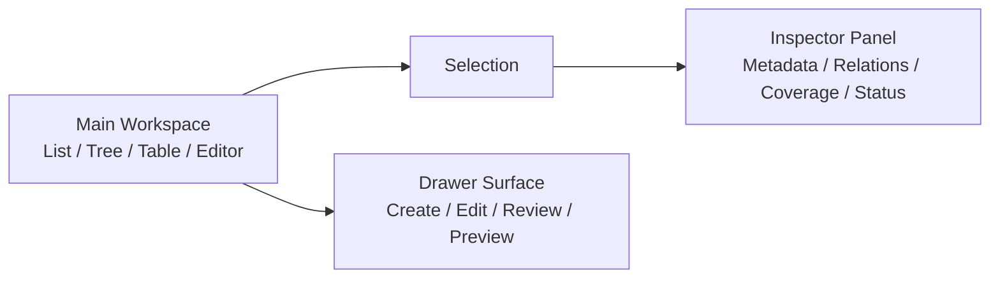

# UI-3C — Workspace, Inspector, Drawer Foundation

## Scope

UI-3C defines the shared workspace pattern for SECURIUM admin and expert-console screens.

Implemented primitives:

- `WorkspaceLayout`
- `InspectorPanel`
- `DrawerSurface`

This sprint does not change database schema, seed data, API routes, repositories, secrets, or deployment settings.

## Workspace model

SECURIUM console screens are divided into three conceptual regions:

1. Main Workspace
2. Inspector Panel
3. Drawer Surface

The main workspace contains the primary list, tree, table, graph, or editor. The inspector shows contextual details for the current selection. A drawer is reserved for temporary secondary tasks.

## Component contracts

### WorkspaceLayout

Use when a page has a primary work area and an optional right-side contextual panel.

- `main` contains the primary page workspace.
- `inspector` contains contextual details.
- On mobile, the inspector stacks above the main workspace to keep the page readable.
- The component does not own business logic or data fetching.

### InspectorPanel

Use for persistent context.

Good examples:

- Selected curriculum node details
- Selected ontology concept metadata
- AI trace summary
- Coverage gap summary
- Audit event metadata

Do not use InspectorPanel for:

- Destructive confirmations
- Long forms
- Multi-step flows
- Temporary modal decisions

### DrawerSurface

Use for temporary task surfaces that should preserve the user’s workspace context.

Good examples:

- Create or edit a curriculum node
- Preview shared content
- Review an AI answer
- Compare a selected concept relation
- Configure a filter preset

Do not use DrawerSurface for:

- Critical irreversible confirmation; use Dialog.
- Full-page creation flows with many dependent steps; use Wizard.
- Persistent context that should always be visible; use Inspector.

## Usage decision matrix

| Pattern | Best for | User mental model |
| --- | --- | --- |
| Main Workspace | Primary task area | “This is where I work.” |
| Inspector | Details about selected thing | “What is this and how is it connected?” |
| Drawer | Temporary side task | “Let me edit or preview without losing context.” |
| Dialog | Focused confirmation | “I must decide before continuing.” |
| Wizard | Ordered multi-step creation | “I need guidance through a sequence.” |

## Admin dashboard pilot

The admin dashboard now uses `WorkspaceLayout`:

- Main: admin action cards
- Inspector: operation state summary and quick links

This validates the foundation on a low-risk page before applying it to denser views.

## Responsive behavior

At narrow widths:

- Workspace becomes a single column.
- Inspector stacks above the main workspace.
- Sticky inspector behavior is disabled.
- Drawer footer actions can stretch to prevent cramped touch targets.

## Accessibility

- Inspector uses `aside` with a descriptive label.
- Drawer uses `aside` and exposes an accessible label derived from title.
- Hidden drawer surfaces use `aria-hidden`.
- Drawer focus management is not implemented in this foundation component; interactive drawers must add focus trap, ESC handling, close controls, and return focus behavior when adopted.

## Rollout plan

1. Admin Dashboard pilot.
2. Curriculum tree page.
3. Ontology Explorer.
4. AI Trace Console.
5. Coverage review.
6. Audit detail pages.

## Validation checklist

- Main workspace remains usable without inspector.
- Inspector content is contextual, not a duplicate page summary.
- Drawer is not used for destructive confirmation.
- Mobile width does not produce horizontal scrolling.
- Keyboard users can reach all visible controls.
- No database, API, or repository change is introduced by layout adoption.
